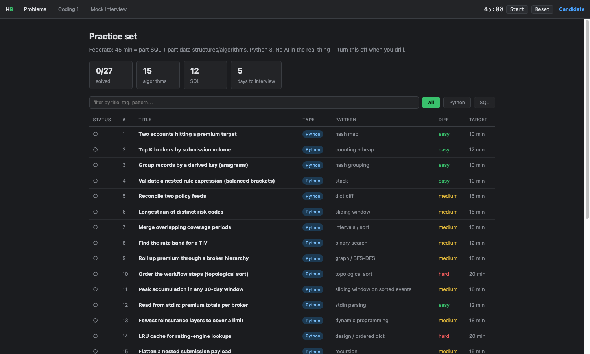

# whetstone

**Sharpen before you go in.**

A self-hosted technical-interview practice environment that looks and behaves like the
HackerRank pad you will actually be sitting in. Runs on your machine, uses only the
Python standard library, and needs no accounts, no network, and no signup.

```
$ ./whetstone
Loaded 27 problems (15 python, 12 sql)

  ==>  http://localhost:8777
```



---

## Why this exists

Most interview prep is a wall of problems with no opinion about what you are weak at.
That is fine if you have three months. It is useless if you have five days and a
specific company on the calendar.

whetstone is built around **packs**: a curated problem set for one company or one kind
of round, written in that domain's vocabulary, each problem carrying its hints, a
reference solution, an explanation of *why the problem is asked*, and the follow-ups
an interviewer is likely to reach for next.

## What you get

- **A real pad.** Split panes, syntax highlighting, a language selector, a stdin
  Input/Output box, Run Code and Submit, and a 45-minute countdown. Deliberately close
  to HackerRank's interview tool so the real thing feels familiar.
- **Two working runners.**
  - *Python:* your code runs in a subprocess against real test cases, with an 8-second
    timeout so an infinite loop fails the test instead of hanging your machine. Supports
    both function-signature problems and stdin/stdout problems.
  - *SQL:* every problem seeds a fresh in-memory SQLite database. Your query is graded by
    executing it and diffing the result set against the reference query, so you can see
    your rows next to the expected rows.
- **Trace mode.** Step through your own code line by line and watch the variables
  change, with the current line highlighted in the editor. It traces *your* code, not a
  canned animation, so it works on a half-finished attempt. For SQL it splits your WITH
  clause and runs each CTE on its own, which is how you debug a query in real life.
- **Ask.** Stuck on *why* rather than *what*? Ask a question in the app and get an
  answer grounded in the problem, your current code, and your last test run. See
  [Using an AI assistant](#using-an-ai-assistant-with-it) — it works with or without an
  API key.
- **Progressive hints**, then the reference solution with an explanation you would
  actually want to read.
- **Mock rounds** that pair one SQL problem with one algorithms problem and start the clock.
- **Progress and code saved** per problem, so you can stop mid-problem and come back.

## Install

There is nothing to install. You need Python 3.8+.

```bash
git clone git@github.com:Ray-Hughes/whetstone.git
cd whetstone
./whetstone
```

Then open <http://localhost:8777>.

`./whetstone verify` runs every reference solution against its own test cases - useful
after you add problems.

The editor uses CodeMirror from a CDN for syntax highlighting; if you are offline it
falls back to a plain textarea and everything else still works.

## Packs

```
packs/
  federato/
    pack.json
    python/py_01_two_sum_premium.py
    sql/sql_01_appetite_join.py
    sql/_core.py            # shared schema + seed, files starting with _ are not problems
  general/
    pack.json
```

The shipped `federato` pack is 27 problems for a Forward Deployed Engineer round that is
part SQL, part data structures and algorithms, written in P&C insurance vocabulary:
submissions, quotes, appetite tiers, portfolio accumulation, loss ratio. The algorithms
are the canonical patterns; the SQL is genuinely the kind of thing you write on the job.

The `general` pack is empty and waiting for contributions.

## Writing a problem

One Python file, one `PROBLEM` dict. See [docs/writing-problems.md](docs/writing-problems.md)
for the full field reference.

```python
PROBLEM = {
    "title": "Two accounts hitting a premium target",
    "difficulty": "easy",              # easy | medium | hard
    "pattern": "hash map",
    "tags": ["hash map", "array"],
    "minutes": 10,
    "mode": "function",                # "function" or "stdin"
    "func": "find_pair",
    "prompt": "...markdown...",
    "starter": "def find_pair(premiums, target):\n    pass\n",
    "hints": ["nudge", "bigger nudge", "almost the answer"],
    "tests": [
        {"args": [[2500, 7500, 11000, 4000], 6500], "expected": [0, 3], "sample": True},
        {"args": [[], 0], "expected": []},
    ],
    "solution": "def find_pair(...): ...",
    "complexity": "O(n) time, O(n) space.",
    "explanation": "...markdown, including the language gotchas...",
    "followups": ["what the interviewer asks next"],
}
```

SQL problems swap `tests` for `schema`, `seed`, and a reference `solution` query; the
grader runs both and diffs the rows.

Run `./whetstone verify` before opening a PR. It fails if any reference solution does not
pass its own tests, which catches most authoring mistakes.

## Using an AI assistant with it

### The Ask panel

Every problem has an **Ask** button. Type a question and the app sends the problem
statement, your current code, and your last test output along with it, so the answer is
about *your* attempt rather than the problem in the abstract.

It works two ways and picks automatically:

- **With credentials** - `pip install anthropic` and set `ANTHROPIC_API_KEY` (or run
  `ant auth login`), and answers appear in the panel.
- **Without** - it assembles the full prompt and gives you a **Copy prompt** button.
  Paste it into whatever AI tool you already use. No key, no install, no signup.

The second mode is the default on a fresh clone, and it is a first-class path rather
than a degraded one - the value is in assembling the right context, which is the part
that is tedious to do by hand.

### Generating packs

whetstone runs locally, so a coding agent working in the same directory can read `packs/`
and write to it. Point it at a company and the round description you were given, and have
it produce problems in the pack format. Tell it to run `./whetstone verify` and fix
whatever fails - the verifier is the quality gate, and it specifically catches wrong
expected values, which is the failure mode LLM-generated problems actually have. Every
problem in the shipped pack went through exactly that loop.

### Turn it off for the drill itself

Many companies explicitly prohibit AI assistance during the interview, and the point of
practising is to find out what you can do without it. Assistance belongs before and after
a problem, not during one. Start the timer, close the panel, and earn the explanation.

## Roadmap

- More packs (contributions very welcome - especially rounds you actually sat)
- A whiteboard tab for system design practice
- Spaced repetition over problems you got wrong
- More languages in the runner (currently Python and SQL)
- Trace mode for more than the first sample case

## Contributing

Open an issue or a PR. The most valuable contribution is a **pack for a round you
actually sat**, with the patterns that really came up. Do not post a company's verbatim
proprietary questions - write problems that teach the same patterns.

## License

MIT. See [LICENSE](LICENSE).
